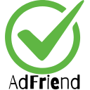
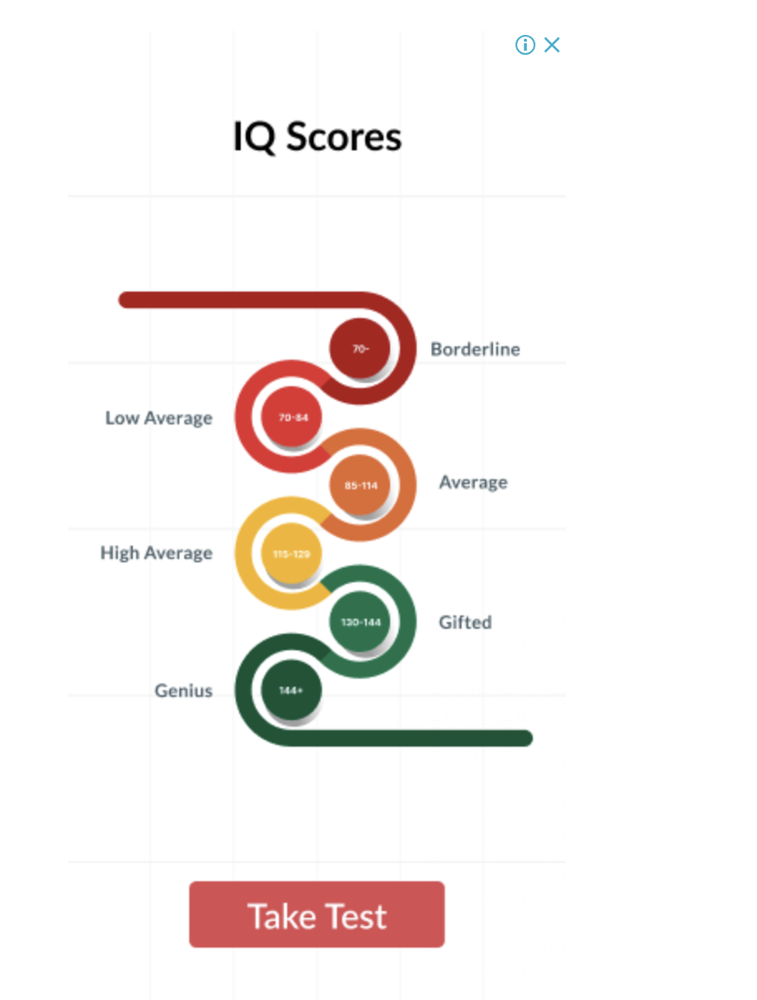
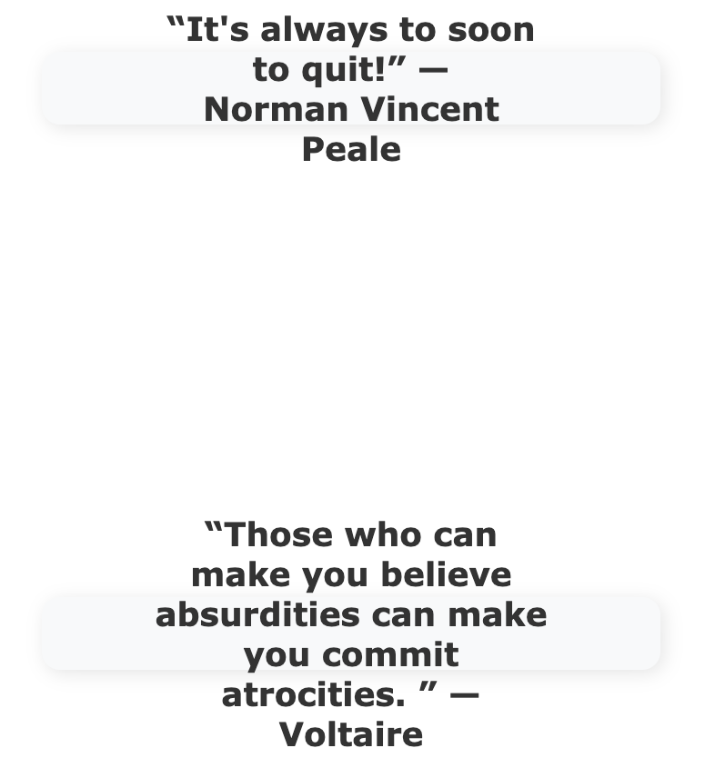

# AdFriend - Replace Ads with Positivity ✨

AdFriend is a **Chrome extension** that replaces intrusive ads with **inspirational quotes and images**, creating a more uplifting and distraction-free browsing experience. 🚀

## ⭐ Features
- 🛑 **Blocks Ads**: Detects and removes advertisements from webpages.
- 🌟 **Inspirational Quotes**: Replaces ads with motivational quotes.
- 🖼️ **Beautiful Images**: Option to fetch stunning images instead of ads.
- 🔄 **Seamless Integration**: Works on most websites without interfering with content.
- 🎚️ **Toggle On/Off**: Easily enable or disable the extension via the popup menu.

## 📸 Screenshots
### Before AdFriend:

### After AdFriend:

## 🚀 Installation
1. **Download** the AdFriend extension from the [Chrome Web Store](#) *(Coming Soon!)*.
2. Click **Add to Chrome** and confirm the installation.
3. Click the **AdFriend icon** in the Chrome toolbar to access settings.
4. Enjoy an ad-free, motivational browsing experience!

## 🎛️ How to Use
1. **Activate AdFriend**: The extension runs automatically after installation.
2. **Customize Experience**:
   - Click the extension icon → Toggle AdFriend On/Off.
   - Choose between quotes or images.
3. **Enjoy Distraction-Free Browsing!** 🚀

## 🔧 Technical Details
- Uses **MutationObserver** to detect ads dynamically.
- Fetches **motivational quotes** from [ZenQuotes API](https://zenquotes.io/).
- Designed to work with most ad-heavy sites *(excluding YouTube ads due to technical limitations)*.
- Built with **HTML, CSS, and JavaScript**, leveraging **Chrome Extension APIs**.

## 🤝 Contributing
Want to improve AdFriend? Feel free to contribute! 🎉
1. **Fork this repository**
2. **Create a feature branch** (`git checkout -b feature-branch`)
3. **Commit your changes** (`git commit -m 'Added an awesome feature'`)
4. **Push to GitHub** (`git push origin feature-branch`)
5. **Create a Pull Request**

## 🔗 Connect With Me

## ⚡ License
This project is licensed under the **MIT License**. Feel free to use and modify it.

---
🚀 **AdFriend – Turning Annoying Ads into Inspiring Moments!** ✨
